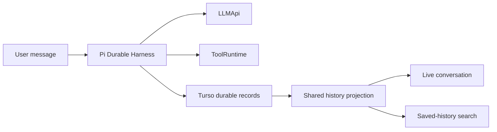
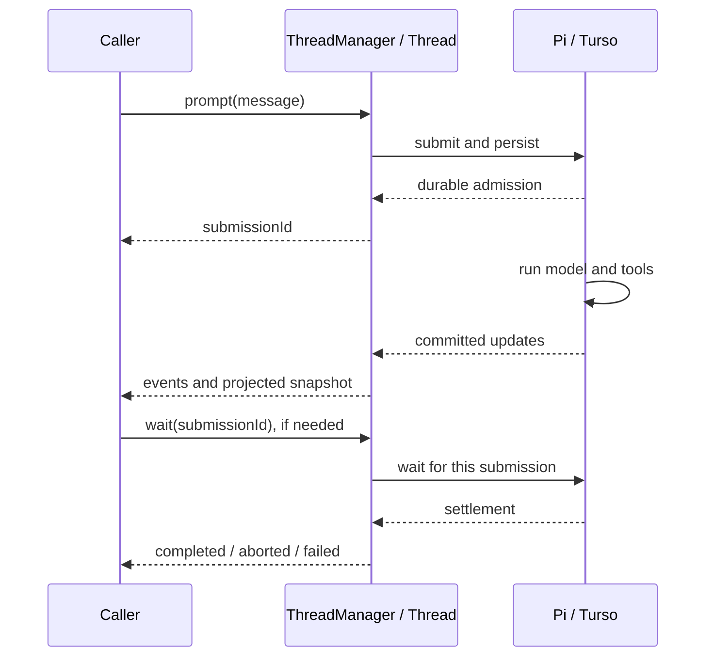
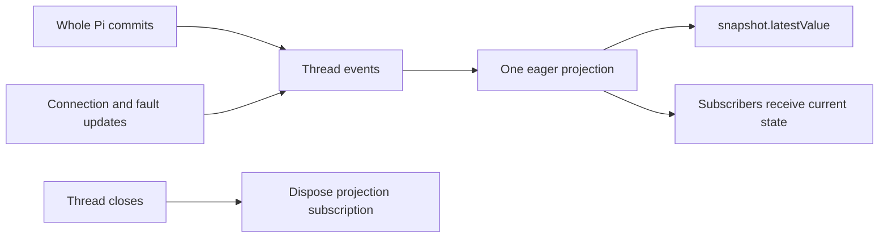
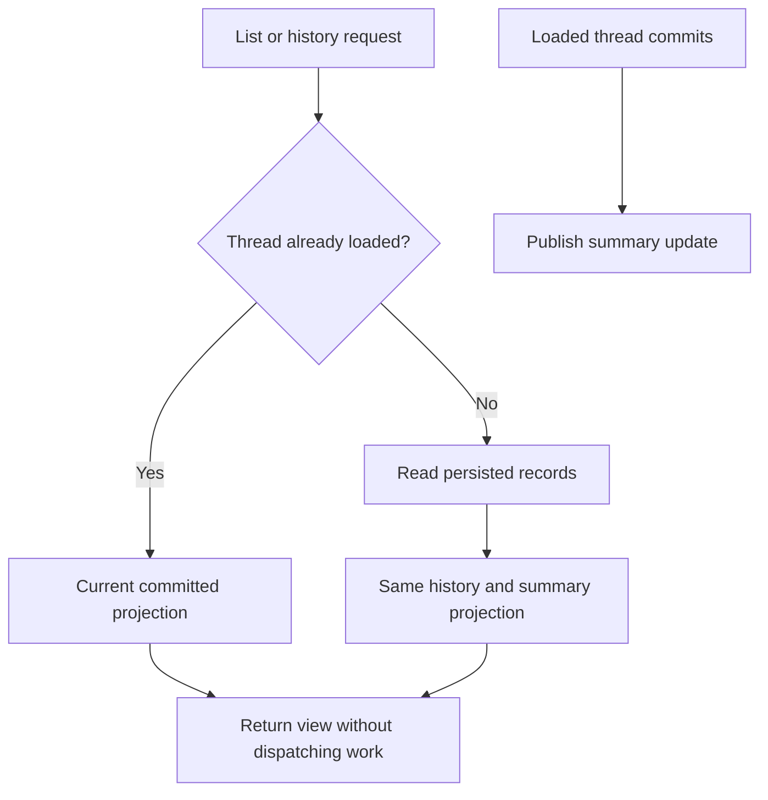
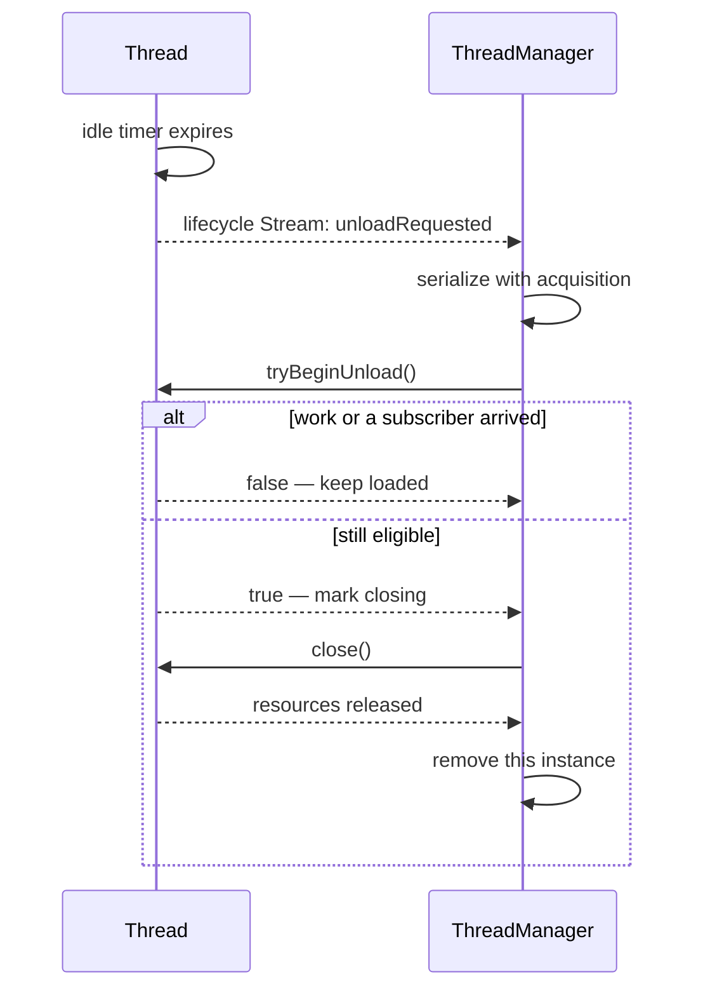
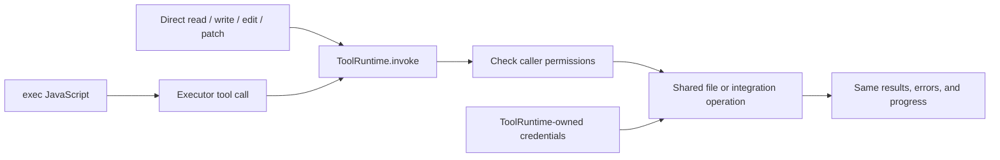
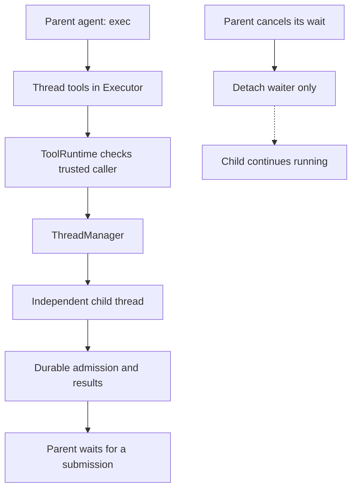

# Pi Durable threads: implementation and remaining plan

This is the living plan for Halo's thread runtime. **Phase 1 landed in PR #358. Phase 2 is implemented locally, not yet committed or shipped.** Phases 3–6 remain planned. Pseudocode describes ownership and ordering, not exact Pi method signatures.

## System flow

### Implemented in phase 1

```diagram
UI / CLI / routines
        │
        ▼
SessionRegistry ── owns loaded HaloAgentSession instances
        │
        ▼
HaloAgentSession
        ├── Pi Durable Harness ── TursoStorage ── DatabaseClient
        ├── LLMApi ── Halo's Together-backed model
        ├── direct tools / exec ── ToolRuntime
        └── committed revisions ── SessionProjection ── UI events

WorkspaceSearch ── persisted session reader ── same SessionProjection
```

### Target after all phases

```diagram
UI / CLI / routines                  another agent's exec
        │                                   │
        │                          ToolRuntime authorization
        │                                   │
        └──────────────┬────────────────────┘
                       ▼
                ┌──────────────┐
                │ ThreadManager│
                │ loaded map   │
                └──────┬───────┘
                       │ open / acquire / close
                       ▼
                ┌──────────────┐
                │ Thread       │── unloadRequested Stream ──→ manager
                │ Pi runtime   │
                └──┬────┬────┬─┘
                   │    │    │
                   ▼    │    ▼
                LLMApi  │  Turso thread storage
                        ▼
                    ToolRuntime
                 authority / tools / tokens
```

## Problem and solution

Halo needs durable conversations without rebuilding Pi's scheduler or maintaining a second execution journal. It also needs a clear owner for loaded conversations, so old threads can leave RAM and agents can use the same operations as humans.

Keep one durable identity per conversation. `Thread` is its loaded runtime, not a separate persistent entity. `ThreadManager` owns the loaded instances. Public operations use `thread.new`, `thread.prompt`, and `thread.events`. Pi owns execution, checkpoints, and recovery. Halo owns product APIs, authorization, presentation, and storage integration.

## Settled decisions

- One agent is one conversation with one durable ID. Do not introduce reusable agent definitions or multiple threads per agent yet.
- The manager's map is a cache of conversations, not interchangeable workers.
- Snapshots are a shared projection of committed thread events with `latestValue`, not separately mutated state. The thread owns the projection's subscription and disposal.
- The thread owns unload eligibility, its idle timer, and a lifecycle Stream. The manager owns instance lifetime and safe reopening.
- Running or queued work, active operations, and subscribers prevent idle unloading.
- Archive hides a conversation. It does not silently abort work. An archived idle thread becomes eligible for unloading.
- Abort, archive, unload, and delete are different operations. Deletion is not part of this plan.
- UI, routines, CLI, and agent tools use the same application operations.
- Direct file tools and `exec` share authorized operations; direct tools need not generate JavaScript.
- Child agents inherit no more authority than their caller. Once created, children are independent; parent cancellation stops waiting, not child execution.
- No legacy session compatibility or automatic Pi traces. Explicit trace APIs are retained in phase 1.

## Goals and non-goals

Preserve prompting, attachments, cancellation, tool activity, history, unread state, routines, and search. Keep model access behind `LLMApi`; only Halo's Together-backed model is needed today.

Do not build a second scheduler, add arbitrary provider selection, introduce a multi-agent orchestration framework, or change the direct tool inventory silently. Current direct tools also include `bash` and `viewImage`; deciding whether to remove these is separate from unifying execution.

## Sources

- [[packages/workspace-server/src/agent/Thread.ts#Thread]] — loaded Pi runtime, durable admission, completion, and projected snapshot.
- [[packages/workspace-server/src/sessions/ThreadManager.ts#ThreadManager]] — loaded threads and product operations.
- [[packages/workspace-server/src/agent/SessionProjection.ts#SessionProjection]] — committed-state projection shared with search.
- [[packages/workspace-server/src/storage/TursoStorage.ts#TursoStorage]] — durable protocol and consistent persisted reads.
- [[packages/workspace-server/src/agent/runtime/ToolRuntime.ts#ToolRuntime]] — authority, Executor, integrations, and credentials.
- [[packages/workspace-server/src/routines/RoutineRunner.ts#RoutineRunner]] — automation and interrupted-run recovery.
- [[packages/workspace-server/src/llm/LLMApi.ts]] — inference boundary.
- [Pi Durable announcement](https://earendil.com/posts/pi-durable/).

## ✅ Phase 1 — Pi 1.0 and Durable baseline: landed

**Today**

Before this phase, Halo ran conversations through the older Pi session APIs and saved its own session entries. Halo had to connect that history to the live model and tool activity.

**Proposed**

Let Pi Durable own execution and recovery, while keeping Halo's Turso adapter. Build the UI and search history from the same saved records so reopening a conversation shows the same result as watching it live. This change landed in PR #358; automatic unloading comes later.



```callstack
 WorkspaceServer.start [[packages/workspace-server/src/server/WorkspaceServer.ts#WorkspaceServer.start]]
-├── older Pi session runtime and Halo entry storage
+├── TursoSessionRepo → native Pi durable records
+├── RoutineRunner.recover [[phase1-server:new:308-309]]
+└── SessionRegistry.start [[phase1-server:new:310-311]]
+    └── HaloAgentSession.attach
+        ├── Harness.open(TursoStorage)
+        └── subscribeCommits → SessionProjection → UI events
```

```ts
onCommittedRevision(publication):
  previous = snapshot
  projection.apply(publication) // whole revision, synchronously
  snapshot = projection.snapshot()
  emitNewEntries(previous, snapshot)
  emitFinishedRunBeforeReplacementStarts(previous, snapshot)
  emitActiveMessageAndToolUpdates(previous, snapshot)

activeRunId = firstInputSubmissionId // stable across model/tool rounds
```

Pi and Chord are pinned to 1.0.0. Saved history remains visible after model-context compaction, and parallel tool results stay in model-call order even when they finish out of order. Retry deduplication and saved settlement order keep message and run identities stable across restart.

Startup aborts interrupted routine work before resuming ordinary conversations. Closing storage waits for admitted database operations; fatal storage failures reach the UI instead of leaving it looking busy. Automatic Pi tracing and legacy entry import/dual-write paths are removed.

**Data reset:** applying the migration discards old conversations and clears their links from routine history. It preserves unrelated workspace data. It has only been applied to disposable local test data here.

### Verification evidence and limitations

- All-package lint, format, typecheck, and unit tasks passed: 53 tasks without cache reuse.
- Latest workspace-server E2Es passed: 119 tests, including explicitly reopening pending work. Storage regression coverage verifies close waits for admitted commits. Both review regressions failed before their fixes and passed afterward. The earlier full run exposed tool-activity ordering after restoring parallel execution; the client projection now preserves model-call order, with a regression covering out-of-order completion.
- Latest Electron run after review fixes: 110 passed, 4 failed. Baseline-reproduced failures are heading removal with Backspace, one-character formatting reveal, specific attachment-error text, and the 30-second unread-session timeout. The unread test passed an isolated branch retry (29.8s) and three isolated baseline runs, but timed out in all four baseline repetitions at the full suite's four-worker concurrency. Earlier search-selection and long-note scrolling failures passed this run. This is not a green full suite; the PR records these exceptions explicitly.
- Real Together inference was exercised through Electron: write/read a file, restart the full dev stack, recall the conversation, then read through `exec`. The resulting screenshot was inspected.
- Full all-package E2Es ran without cache reuse. Other package results: client 7 passed, extension tools 4 passed, logger 2 passed, control-plane 20 passed / 1 skipped. Only the Electron task failed.

### Actual phase-1 wiring diff

```source-diff:phase1-server:packages/workspace-server/src/server/WorkspaceServer.ts
diff --git a/packages/workspace-server/src/server/WorkspaceServer.ts b/packages/workspace-server/src/server/WorkspaceServer.ts
index a1950f76..50f27216 100644
--- a/packages/workspace-server/src/server/WorkspaceServer.ts
+++ b/packages/workspace-server/src/server/WorkspaceServer.ts
@@ -214,7 +214,7 @@ export class WorkspaceServer {
         });
     });
     const sessionRepo = new TursoSessionRepo(database);
-    const search = new WorkspaceSearch({ workspace, database });
+    const search = new WorkspaceSearch({ workspace, repo: sessionRepo });
     cleanup.defer(async () => {
       const closed = await sessionRepo.close();
       if (closed instanceof Error)
@@ -285,8 +285,6 @@ export class WorkspaceServer {
       environment: config.environment,
       repo: sessionRepo,
       llmApi: host.llmApi,
-      traces,
-      model: host.llmApi.model,
       filesystem,
       layout: workspace.layout,
       toolRuntime,
@@ -307,6 +305,10 @@ export class WorkspaceServer {
       logger: host.logger,
     });
     cleanup.defer(async () => await routineRunner.stop());
+    const recoveredRoutines = await routineRunner.recover();
+    if (recoveredRoutines instanceof Error) return recoveredRoutines;
+    const recovered = await sessions.start();
+    if (recovered instanceof Error) return recovered;
     const routineScheduler = new RoutineScheduler({
       routines,
       runner: routineRunner,
```

## ✅ Phase 2 — Explicit manager and thread ownership: implemented locally

**Today**

After phase 1, routers and routines could keep references to loaded sessions. Each snapshot subscriber built its own view, and sending a prompt could leave the request waiting for the model to finish.

**Proposed**

Put loaded conversations behind `ThreadManager` and name the public operations `thread.*`. Give each thread one shared snapshot with `latestValue`, and acknowledge a prompt as soon as it is saved; callers that need the final result wait separately. This phase is implemented locally, but is not committed or shipped.

The existing owners are renamed, not duplicated. Routers and routines use manager operations instead of retaining runtime objects. The namespace is `thread.*`, with no `sessions.*` alias. Protocol 24 is the only supported version. Existing transport DTO names and the `sessionId` field remain; these are not compatibility endpoints.

The unshipped durable-storage migration now creates `halo_threads` and partitions durable records by `thread_id`; routine references use `thread_id` and `auto_archive_thread`. The repository is `TursoThreadRepo`/`ThreadRepoApi`, and Halo's presentation document is `halo.thread`. Pi's own `conversation_id` and session-scoped document terminology, and unrelated OAuth sessions, are unchanged. This edits the existing migration as requested, rather than adding a rename migration or compatibility reader. Any disposable database that already applied the previous version must be reset; migration checksums intentionally reject the changed definition.

```callstack
 threadRouter / RoutineRunner
-└── SessionRegistry → HaloAgentSession
+└── ThreadManager [[packages/workspace-server/src/sessions/ThreadManager.ts#ThreadManager]]
+    └── Thread [[packages/workspace-server/src/agent/Thread.ts#Thread]]
```

```ts
class ThreadManager:
  loaded: Map<ThreadId, Thread>
  new({ requestId? }) -> { sessionId }
  prompt({ sessionId, clientMessageId?, text, files?, references? }) -> { submissionId }
  wait({ sessionId, submissionId }, signal?) -> completion
  events(sessionId) // transport bootstraps a snapshot, then committed updates
  abort(sessionId)
  list() -> ThreadSummary[]

class Thread:
  static open(storage, llmApi, toolRuntime)
  prompt(message)
  events: ReadonlyStream<ThreadEvent>
  snapshot: ReadonlyProjectedStream<ThreadSnapshot>
  abort()
  close()
```

### Shared projected snapshots

```ts
// Implemented shared projection semantics.
thread.snapshot = thread.events.project(persistedSnapshot, reduceThreadEvent)
thread.snapshot.latestValue
unsubscribe = thread.snapshot.subscribe(render) // immediately receives current state
// On thread close: dispose the projection's source subscription.
```

The projection subscribes once when constructed, reduces once per event, and remains current with zero external subscribers. Late subscribers receive the current value rather than rebuilding from an old seed. Preserve whole-commit atomicity: adapt each Pi commit into a complete thread revision, not separately visible partial updates. Reconstruct the initial snapshot from storage and attach to commits without a gap. This is an in-memory projection, not another durable event journal. Product connection/fault updates must also flow through the reducer.

`Stream.project()` now owns one eager subscription rather than reducing separately per subscriber. Both the server thread and React consumer dispose their projections. Plain event streams remain event-only. Internal projection subscriptions must not count as external observers when unloading is implemented. The transport retains snapshot-first reconnect semantics; an in-process getter alone does not provide remote synchronization.

### Prompt acknowledgement: durable acceptance, approved and implemented

Pi's `conversation.submit()` returns a Submission handle after durable admission. Its `id`, `status()`, and `wait()` separate acceptance from settlement. Pi does not prescribe Halo's RPC response shape; Halo now exposes that separation explicitly.

`thread.prompt(...) -> { submissionId }` always acknowledges durable acceptance. `thread.wait({ sessionId, submissionId })` returns `completed`, `aborted`, or `failed`; routines explicitly await it. Cancelling the waiter does not cancel execution. After reconnect/restart, callers can wait on the same ID. IDs identify individual Pi submissions within a thread, not enclosing runs. The UI observes completion through `thread.events` rather than holding a prompt request open.

`clientMessageId` is the prompt retry key passed to Pi. `thread.new({ requestId })` derives a filesystem-safe thread identity and serializes creation, so retrying the same key across concurrent calls or restart opens the same thread. Omit the key to create a fresh thread. This is admission deduplication, not an exactly-once guarantee for external tool effects.





```callstack
 prompt caller
-└── prompt request → wait for execution
+├── thread.prompt → durable admission → submissionId [[phase2-contract:new:188-190]]
+├── thread.events → snapshot first, then updates
+└── thread.wait → per-submission completion [[phase2-contract:new:191-197]]
```

- [Pi submission contract](https://github.com/earendil-works/pi/blob/v1.0.0/packages/durable/docs/spec.md#L487-L496)
- [Pi durable admission implementation](https://github.com/earendil-works/pi/blob/v1.0.0/packages/durable/src/harness/submissions.ts#L53-L87)

Verification after the database rename:

- `pnpm run check-affected`: 52 tasks passed, including 47 workspace-server unit tests.
- Server E2Es: 119/120 passed; the remaining test still queried the old SQL names. After correcting that test, the full search file passed (5/5). Coverage includes durable acceptance, waiter cancellation, creation/prompt deduplication across restart, and distinct steering submissions.
- Rebuilt Electron chat/search E2Es: 35 passed, 2 failed. The attachment-error wording assertion is the known baseline failure. The unread test timed out at 30 seconds under concurrency, then passed alone with its unchanged timeout (26.8s). This is not a green whole Electron suite. An earlier broader run overlapped the storage rename and had missing-module startup failures, so it is not verification of the final tree.
- Real Together inference through Electron wrote/read `cobalt crane 482`. After resetting the disposable dev database for the edited migration, a new thread queried `halo_threads` through `exec`, returned count 1, and retained the reply/tool activity after reload. The screenshot was inspected; no renderer errors were reported.

Startup still loads all saved threads; phases 3–4 change that behavior.

### Actual phase-2 contract diff

```source-diff:phase2-contract:packages/client/src/contract.ts
diff --git a/packages/client/src/contract.ts b/packages/client/src/contract.ts
--- a/packages/client/src/contract.ts
+++ b/packages/client/src/contract.ts
@@ -176,14 +176,24 @@ export const contract = publicProcedure.router({
     markUnread: oc.input(type<{ sessionId: string }>()).output(type<void>()),
     markDone: oc.input(type<{ sessionId: string }>()).output(type<void>()),
     markUndone: oc.input(type<{ sessionId: string }>()).output(type<void>()),
-    create: oc.output(type<{ sessionId: string }>()),
+    new: oc
+      .input(type<{ requestId?: string } | undefined>())
+      .output(type<{ sessionId: string }>()),
     snapshot: oc
       .input(type<{ sessionId: string }>())
       .output(type<SessionSnapshot>()),
-    watch: oc
+    events: oc
       .input(type<{ sessionId: string }>())
       .output(asyncIteratorObject(type<SessionWatchItem>())),
-    prompt: oc.input(type<ChatPrompt & { sessionId: string }>()),
+    prompt: oc
+      .input(type<ChatPrompt & { sessionId: string }>())
+      .output(type<{ submissionId: number }>()),
+    wait: oc.input(type<{ sessionId: string; submissionId: number }>()).output(
+      type<{
+        status: "completed" | "aborted" | "failed";
+        error?: { message: string };
+      }>(),
+    ),
     startConnection: oc
       .input(
         type<{
```

## Phase 3 — Read idle conversations without loading them: planned

**Today**

Search can read saved conversations directly, but the sidebar list still depends on loaded threads. Reading a conversation snapshot also opens its runtime, even when the caller only wants history.

**Proposed**

Read saved history and sidebar summaries from storage without starting an agent. Use the same projection for saved and live threads so titles, unread state, and results agree in both views.



```callstack
 list / saved history
-└── loaded session → readSummary / readSnapshot
+└── session repository → persisted projection
 live conversation
 └── manager → loaded thread → committed projection
```

```ts
list():
  return storage.listSummaries() // no Harness.open and no scheduling

history(threadId):
  return project(await storage.read(threadId))

onLoadedThreadCommit(threadId, revision):
  publishSummary(projectSummary(revision))
```

Summary updates remain observable without retaining a UI subscription on every thread. The important test is that listing, searching, or reading history cannot dispatch model or tool work. This prepares the read side for unloading in phase 4.

## Phase 4 — Thread-requested unloading and selective recovery: planned

**Today**

Startup opens every saved thread, and loaded threads stay in memory until explicitly closed or the server stops. Archiving changes visibility but does not release the runtime.

**Proposed**

Let an idle thread ask the manager to unload it through a lifecycle stream. The manager checks that it is still idle, closes it safely, and opens it again when needed; startup only resumes threads with unfinished work.



```callstack
 WorkspaceServer.start
-└── open every saved thread → resume
+├── recover interrupted routines
+└── find threads with pending work → open → resume
 idle thread
+└── lifecycle Stream → unloadRequested
+    └── manager rechecks eligibility → close → remove
```

```ts
thread.canUnload():
  return !hasPendingWork && inFlightOperations == 0 && externalSubscribers == 0

thread.onIdleTimeout():
  if canUnload(): lifecycle.append({ type: "unloadRequested" })

manager.onUnloadRequested(threadId, thread):
  lifecycleQueue(threadId).run(async () => {
    if loaded.get(threadId) !== thread: return
    if !thread.tryBeginUnload(): return
    await thread.close()
    loaded.delete(threadId)
  })

manager.prompt(input):
  using lease = await acquire(input.threadId) // same lifecycle coordination
  return await lease.thread.prompt(input)

manager.start():
  await recoverInterruptedRoutines()
  for threadId in storage.findThreadsWithPendingWork():
    (await open(threadId)).resume()
```

Keep model calls and tool execution outside lifecycle queues. A thread closing unsuccessfully must not admit a replacement storage owner until resource release is known. Idle timeout length is a tunable implementation choice, not a new product setting.

The event is a request, not proof that unloading is still safe. Pending work, active operations, and external subscribers prevent unloading; archive makes an idle thread eligible without aborting it. Ignore requests from an old instance after replacement. Verification must exercise new work arriving during close, simultaneous opens, reconnect, and shutdown—not just the idle timer.

## Phase 5 — One authorized tool operation path: planned

**Today**

Direct file tools and tools called through `exec` use separate wrappers around shared implementations. Both enforce permissions, but there are still two places to wire execution behavior.

**Proposed**

Send both forms through the same `ToolRuntime` operation. Keep the direct tools as convenient shortcuts, while `exec` adds JavaScript composition around those same operations.



```callstack
 direct read/write/edit/patch and exec
-├── direct wrapper → authority + shared file implementation
-└── Executor wrapper → authority + shared file implementation
+├── direct wrapper → ToolRuntime.invoke
+└── Executor invocation → ToolRuntime.invoke
```

```ts
directRead(args, context):
  return toolRuntime.invoke("files.read", args, context)

exec.tools.files.read(args):
  return toolRuntime.invoke("files.read", args, trustedExecutionContext)
```

Context carries agent identity, effective permissions, cancellation, and tool-call correlation. Credentials remain owned by ToolRuntime. Executor supplies JavaScript composition, not a separate authorization policy.

Preserve tool schemas, output formatting, errors, progress, and file-access boundaries. Keep the existing direct tool inventory until a separate product decision removes a tool. Verify the same successful and denied operations through both surfaces, moving one operation family at a time.

## Phase 6 — Agents can start and message agents: planned

**Today**

Humans and routines can create and prompt threads through the manager. Agents do not yet have authorized thread-management operations inside `exec`.

**Proposed**

Expose those same manager operations as tools, so an agent can start a child conversation, send messages, and wait for results. The host supplies the caller identity and permissions; creating a child must not give it more access than its parent.



```callstack
 agent exec
 └── Executor plugin
+    └── ToolRuntime authorization
+        └── ThreadManager.new / prompt / wait / events / abort
```

```ts
// Agent-authored code; caller identity is injected, never trusted from args.
child = await tools.thread.new({ requestId: stableCreationId })
accepted = await tools.thread.prompt({
  sessionId: child.sessionId,
  clientMessageId: stableMessageId,
  text: "Investigate the report",
})
result = await tools.thread.wait({ ...child, ...accepted })

// Host side
newChild(input, caller):
  authorize(caller, "threads.create")
  permissions = noBroaderThan(caller.permissions)
  return manager.newIdempotently(input.requestId, permissions)
```

Use trusted per-call context and register the plugin at server composition; do not give models control over caller identity. Authorization applies to reading and controlling other conversations as well as creation. The pseudocode illustrates wrapping phase 2's admission/wait operations; the exact tool schemas and result envelope remain to be chosen.

Stable request IDs prevent retries from creating duplicate children or messages. Once created, a child runs independently: cancelling its parent's wait does not abort it. Verify creation, messaging, access denial, cancellation, and restart through actual tool calls, without introducing a second agent service.

## Delivery boundaries

PR #358 landed phase 1. Phase 2 is implemented locally and remains uncommitted and unshipped. A ✅ marks implementation completion, not deployment or a fully green test suite; the verification limitations above still apply. For completed phases, **Today** describes the starting point before that phase and **Proposed** describes the implemented change. Phases 3–6 remain planned and should be delivered separately. No phase requires a new compatibility layer.
